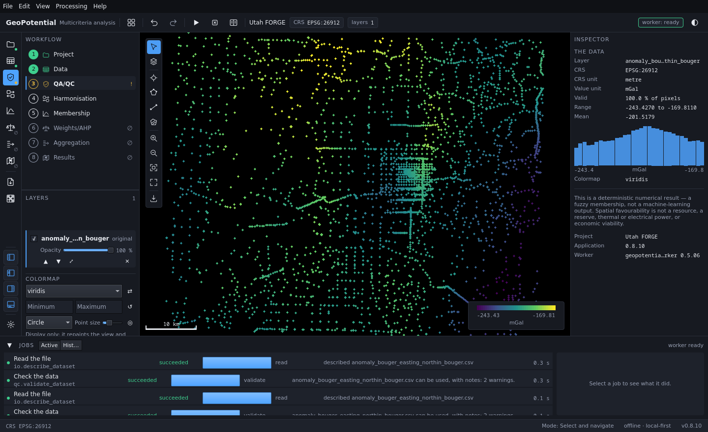
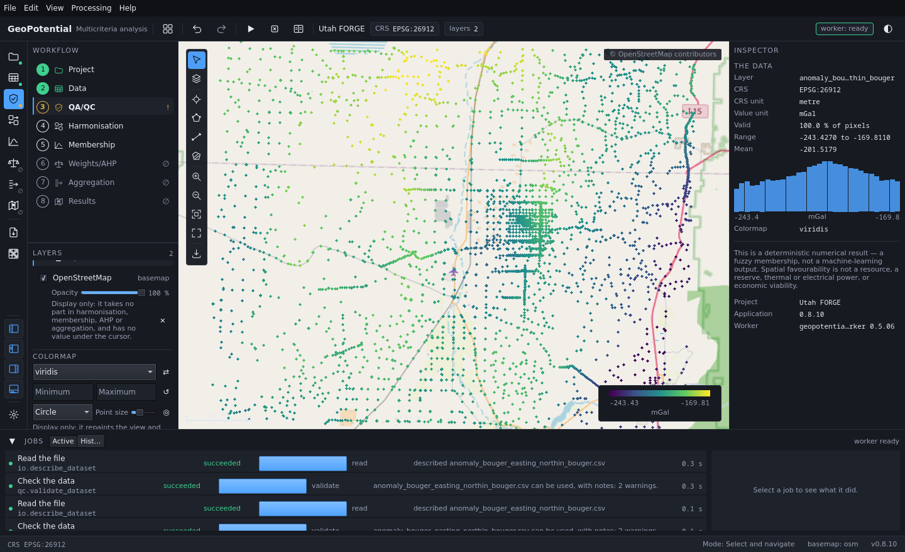
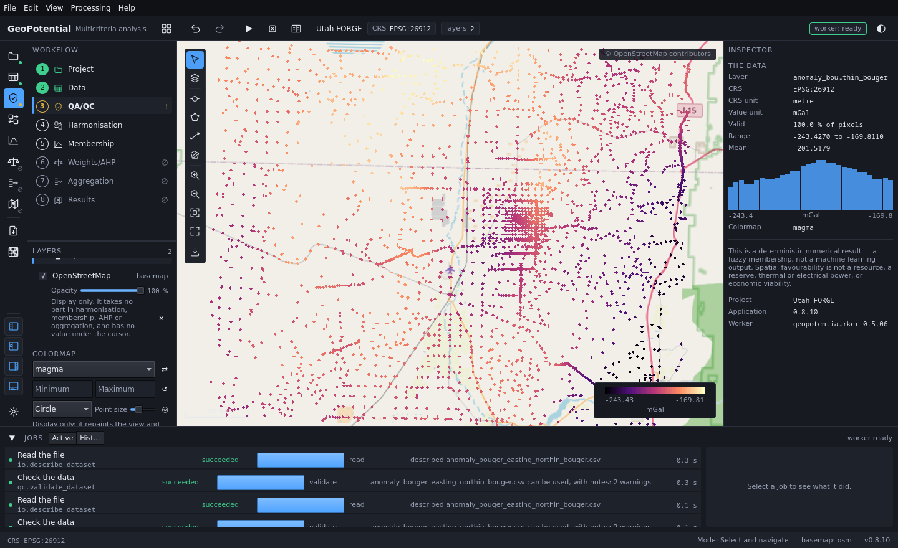
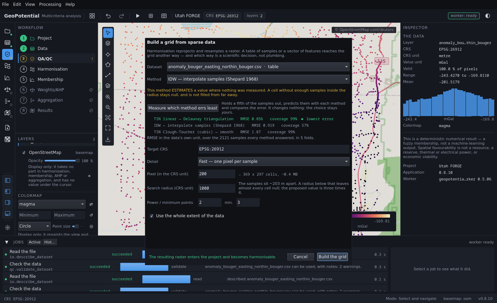
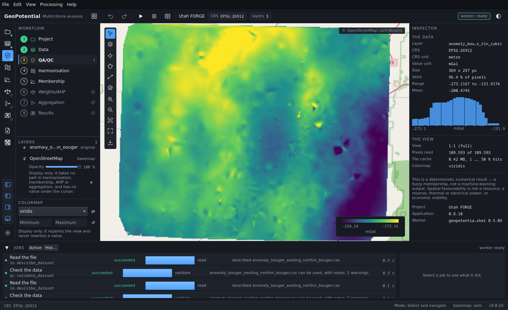
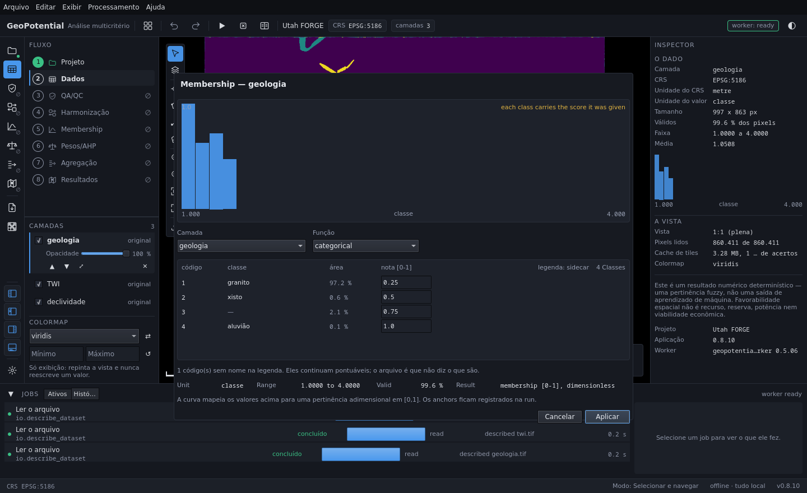

# GeoPotential

**A local-first, auditable desktop application for spatial multicriteria
decision analysis of geoscientific data.**

It loads vector, raster and tabular layers, brings them onto one analysis grid,
turns each into a dimensionless suitability membership, and aggregates them
into a prospectivity map — recording every choice that produced it.

[](https://github.com/marcuslucamaral/GeoPotential/actions/workflows/gate.yml)


> ### 🚧 In development
>
> This is version `0.8.12` and it is **not 1.0**. The whole path — import,
> QA/QC, gridding, harmonisation, membership, aggregation — runs end to end and
> is covered by an executable gate. What is not finished is listed openly in
> **[What is not done yet](#what-is-not-done-yet)**, and the `CHANGELOG.md`
> states what every release does *not* deliver.

> **Spatial favourability is not a resource, a reserve, thermal power,
> electrical power, or economic viability.** The application says so on the
> screen that produces the map, not only here.

---

## From points to a field


3 735 Bouguer gravity stations from **Utah FORGE** → an open-source basemap
placed under them → the ramp changed, which repaints and rewrites nothing → the
three interpolators measured on this survey → the Clough-Tocher field.

Every frame above is checked. These are not hand-taken captures: the
application is driven by a script, captured, and asserted against numbers, so
a frame showing a screen the product does not produce fails the build.

### Two videos, and the difference matters

🎬 **[Watch it work — 2 min](docs/validation/demo-live.mp4)**
A real screen recording: a live window, the pointer moving, the interface
repainting. It walks the import wizard's refusal and the declaration that lifts
it, the basemap arriving under the data, three colour ramps, all four themes,
cross-validation of the three interpolators, the Clough-Tocher field,
membership, the potential-field workbench and the decision model.

🎬 **[The checked sequence — 32 s](docs/validation/demo.mp4)**
Assembled from the gated storyboard frames, over **two** datasets — Utah FORGE
and landslide susceptibility — so you can see the same workflow on two
unrelated problems.

The live one is more convincing and proves less: nothing in it fails if the
interface changes. The checked one cannot show a screen the product does not
produce. Both are rebuilt by `tools/record_demo.py` and
`tools/make_demo_video.py`.

---

## What it already does

**Reads six formats and diagnoses them first.** GeoTIFF/COG, GeoPackage,
Shapefile, GeoJSON, CSV and XYZ. Every dataset is described and checked against
fourteen spatial QA/QC rules — CRS, unit, NoData, coverage, overlap,
resolution, duplicates, gaps, finiteness — **before** it can enter the project.
Each finding says what is wrong, why it matters, and what to correct.

**Never guesses what it was not told.** There is no default CRS: a missing or
ambiguous one stops the run and names the file. A CSV declares its unit and its
coordinate columns in a sidecar, or the absence is reported. A column of text
cannot be a measurement, and is excluded rather than guessed at.

**Turns scattered samples into a grid, and measures which interpolator fits.**
Shepard IDW, Delaunay linear and Clough-Tocher, scored by k-fold
cross-validation **on the survey itself** — the application has no preferred
interpolator and reports each method's error in the data's own unit.

**Draws a large raster without reading it.** Filling a screen from a
16-megapixel layer reads about 6 % of it, at a level of detail chosen from the
scale. The value under the cursor is always read from the source at full
resolution — never from the decimated tile on screen, which is an average and
not a measurement.

**Membership follows the type of the value.** A continuous field takes a curve
chosen against its own histogram. **Classes** take a scored table, and a class
present in the data but unscored is refused rather than silently scored zero.
A **direction** takes a circular membership, because 359° and 1° are two
degrees apart and every linear curve puts them at opposite ends.

**Reports the extent policy before you choose it.** Intersection and union are
different maps. The application measures both and shows the number the choice
turns on — how many cells would actually carry a score.

**Potential-field transforms that declare their assumptions.** Spectral
derivatives, upward continuation, reduction to the pole, analytic signal, tilt
and the radial spectrum. What the data *is* has no default, and the five
transforms that infer ∂/∂z from horizontal data are **refused** on a field that
does not satisfy Laplace's equation — with the refusal naming what still works.

**Answers "how much does this depend on that".** Leave-one-out over the
criteria, Spearman rank correlation, a gamma sweep, and a per-cell explanation
of why a score is what it is. These measure; they change nothing.

**Every result reproduces itself.** A completed run is immutable and writes a
manifest with input paths and checksums, CRS, grid, per-layer method and
parameters, aggregation method, weights and package versions. A result with no
manifest is not a result.

**Nothing leaves the machine.** No telemetry, no cloud, no account. The one
network call is an optional open-source basemap, off by default, display only,
and never an input to anything.

---

## Screenshots

### A CSV is drawn before anything is interpolated


3 735 gravity stations in `EPSG:26912`, −243.4 to −169.8 mGal. A table is not a
grid, and the application says so: it cannot be harmonised until it becomes one.

### An open-source basemap, off by default and display only


It takes no part in harmonisation, membership, AHP or aggregation, and has no
value under the cursor — the panel says exactly that.

### The ramp repaints the view and never rewrites a value


The range in the Inspector is identical before and after. Had the data been
rewritten, the minimum and maximum would have moved with it.

### Which interpolator suits *this* survey, measured


k-fold cross-validation on the survey's own points. On this one it recommends
the linear triangulation — and the next frame runs the cubic anyway, because a
recommendation is evidence offered to the operator, not a decision taken from
them.

### The Clough-Tocher field


Piecewise cubic over the Delaunay triangulation. Outside the convex hull there
is no value and the application leaves it null rather than extrapolating — the
edge you can see is that refusal.

### The same workflow on landslide susceptibility


A score per class, with the share of the map each covers. Applying waits until
every class has one.

---

## Getting started

### Option A — from source, in a virtual environment

**Use a virtual environment.** These instructions never install into your
system Python, so nothing on your machine changes outside the environment
directory, and deleting that directory undoes everything.

```bash
git clone <repository-url> geopotential
cd geopotential
```

**With conda** (recommended — the geospatial stack comes as binaries):

```bash
conda create -n geopotential python=3.11
conda activate geopotential
conda install -c conda-forge pyside6 rasterio geopandas pyproj shapely scipy pandas
```

**Or with `venv`**, which needs nothing installed system-wide — the
`rasterio` and `pyogrio` wheels carry their own GDAL:

```bash
python3 -m venv .venv
source .venv/bin/activate
pip install -r requirements.txt
```

If `python3 -m venv` reports that the module is missing, Debian and Ubuntu
split it into its own package: `sudo apt install python3-venv`.

Verified on a clean clone with Python 3.10.12 and no conda: the full gate
returns `37 passed, 0 failed, 0 blocked, of 37`.

Then:

```bash
./run.sh                 # open the application
./run.sh FILE.tif ...    # open it with layers already loaded
./tools/run_gate.sh      # the full regression: 37 checks, ~4 minutes
```

To remove everything: `conda env remove -n geopotential`, or delete `.venv/`.

### Option B — packaged, no Python at all

A release archive carries its own interpreter, Qt, GDAL and PROJ. A clean
Ubuntu with no Python, no conda and no internet runs it.

```bash
sha256sum -c geopotential-<version>-linux-x86_64.tar.gz.sha256
tar -xzf geopotential-<version>-linux-x86_64.tar.gz
cd geopotential-<version>-linux-x86_64

./install.sh                 # into ~/.local, no root
sudo ./install.sh --system   # into /opt, every user

geopotential --self-test     # must end: 59/59 checks passed
geopotential
```

**That self-test is the point.** The bundle carries its own test suite and runs
it against itself on the machine it landed on — which a clean build log cannot
do. Over SSH without a display, prefix `QT_QPA_PLATFORM=offscreen`.

To remove: `./install.sh --uninstall`. Your projects are untouched.

---

## Example data

The repository ships the datasets its gates run on, each with provenance.
Third-party data arrives with a DOI, a licence and a checksum verified on
download. **Every file under `data/` is exercised by a gate** — it walks the
directory rather than naming files, so an unused fixture cannot accumulate.

| Directory | What it is | Source | Licence |
|---|---|---|---|
| `data/utah_forge/` | Geothermal characterisation: gravity, Vp/Vs, density, basement depth, magnetotelluric resistivity, distance to fault | US DOE [Geothermal Data Repository](https://gdr.openei.org/) | see GDR |
| `data/conditioning_factors/` | 20 landslide-susceptibility layers, Korea, `EPSG:5186` | Kim, Lee & Yoon | CC BY 4.0 |
| `data/britain_magnetic/` | Airborne total-field magnetic anomaly | British Geological Survey · [DOI](https://doi.org/10.5281/zenodo.5879260) | CC BY 4.0 |
| `data/bushveld_gravity/` | Observed and preprocessed gravity, Bushveld Complex | NOAA NCEI + ETOPO1 · [DOI](https://doi.org/10.5281/zenodo.6511942) | CC BY 4.0 |
| `data/southern_africa/` | Topography raster and regional gravity over one region | NOAA NCEI · [DOI](https://doi.org/10.5281/zenodo.5882430); AWS Terrain Tiles | CC BY 4.0 / public domain |
| `data/natural_earth/` | Land polygons, 1:110m | [Natural Earth](https://www.naturalearthdata.com/) | public domain |

> *Contains British Geological Survey materials © UKRI 2021.*

`data/synthetic/` is generated, seeded and regenerable — it is not committed.
Build it with `python tools/make_synthetic_data.py`.

---

## How it is built

Two processes. The interface never computes, and the science never draws.

```
Qt Quick (QML)
      │
Python / PySide6 application layer        ← ViewModels, Project Store, canvas
      │  JSON Lines over stdin/stdout
Python scientific worker                  ← a separate process. No Qt, ever.
```

No HTTP between them, no localhost, no embedded server, no browser.

```
.
├── app/geopotential_app/      Qt Quick shell, ViewModels, Project Store, canvas
│   └── qml/                   the interface
├── worker/geopotential_worker/
│   ├── domain/                Layer, Criterion, TargetGrid, CRS
│   ├── io/                    readers, writers, description
│   ├── qc/                    the fourteen QA/QC rules
│   ├── grid/                  interpolation, harmonisation, planning
│   ├── decision/              membership, AHP, aggregation, correlation
│   ├── potential_fields/      spectral operators
│   ├── scenarios/             sensitivity and explanation
│   └── operators/             27 registered operators
├── data/                      the datasets above
├── docs/
│   ├── ARCHITECTURE.md        verified, enforced by a checker
│   ├── decisions/             7 ADRs, each with the measurement behind it
│   ├── conventions/           the engineering rules this project holds to
│   └── validation/            gate evidence, storyboards, frames
└── tools/                     gate, build, storyboards, demo video
```

### Evidence, not assertions

| | |
|---|---|
| Regression gate | **37 of 37** · 1000 tests |
| Interface self-test | 59 checks, run against the *shipped binary* |
| Visual evidence | 12 storyboards, 61 frames, each with numeric assertions |
| Architecture | enforced by a checker, negative-tested 11/11 |
| Recorded decisions | 7 ADRs |

---

## What is not done yet

Stated here rather than discovered later.

- **AHP has no path through the interface.** The operator is implemented and
  tested and nothing calls it: the pairwise comparison matrix has no screen, so
  the consistency ratio — a blocking refusal by design — cannot be computed
  from inside the application. Weights can be entered directly and the
  weighted combination works.
- **No export button.** Results are standard GeoTIFF in
  `<project>/artifacts/` and open in QGIS as they are, but copying one out with
  a chosen name is a trip to the file manager.
- **The view is not persisted.** Reopening a project restores its layers, not
  their order, visibility, opacity or colormap.
- **Gridding and rasterising are not on the workflow rail.** A CSV must become
  a grid before harmonisation; that step lives in the Processing menu, off the
  eight-step path that otherwise guides you.
- **The class legend is read but never written**, and class names do not reach
  the manifest — whoever reproduces a run sees `4`, not "alluvium".
- **Linux x86_64 only.** Windows and macOS need their own builds and are
  untested.
- **The worker's own messages are English-only**, though the interface is
  fully PT/EN.
- **No CI, no SBOM, no `.deb`.** These are the current milestone.

---

## Citation

The method this application implements is described in:

> do Amaral, M.L.A.; Caldeira, M.C.O.; de Figueiredo, J.J.S.;
> Da Silveira, J.R.B.S. (2026). **Integration of geophysical data and
> multicriteria decision analysis for geothermal assessment at Utah FORGE.**
> *Geothermics* **136**, 103590.
> <https://doi.org/10.1016/j.geothermics.2025.103590>

---

## References

The science is cited where it is implemented, in the function that implements
it.

Saaty (1980), *The Analytic Hierarchy Process* · Zadeh (1965), *Fuzzy Sets* ·
Zimmermann & Zysno (1980), the γ operator · Shepard (1968), IDW · Stone (1974),
cross-validation · Blakely (1995), *Potential Theory in Gravity and Magnetic
Applications* · Nabighian (1972), analytic signal · Baranov (1957), reduction
to the pole · Miller & Singh (1994), tilt · Spector & Grant (1970), radial
spectrum · Saltelli et al. (2008), *Global Sensitivity Analysis*

---

## Licence

**Apache License 2.0** — see [`LICENSE`](LICENSE) and [`NOTICE`](NOTICE).

You may use, modify and redistribute this software, including commercially,
provided the licence and notices travel with it. Contributors grant a patent
licence, and it terminates for anyone who starts patent litigation over the
work.

**The data is not covered by it.** Every dataset under `data/` keeps the
licence it was published under — four of the six are CC BY 4.0 — and those
require attribution to travel with any redistribution, including inside a
packaged build. They are collected in
[`THIRD-PARTY-NOTICES.md`](THIRD-PARTY-NOTICES.md), which is the single place a
redistributor needs to read.
