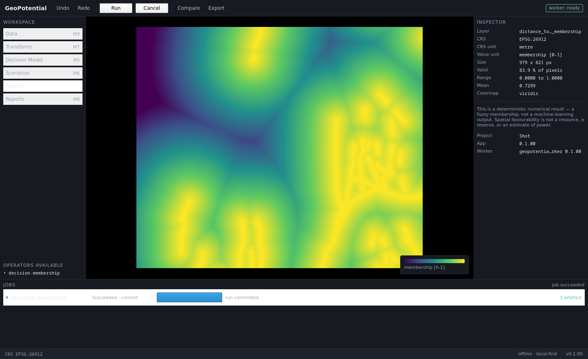

# V-M0/M1 — Reality check, baseline, and the M1 vertical slice

Date: `2026-09-01`
Result: **PASS**
Milestones: `M0` (complete), `M1` (vertical slice complete; the skeleton's
remaining surfaces are listed in `../PROJECT_STATE.md`)
Environment: conda `mcda_geo`, Python 3.11.14, PySide6 6.10.1, numpy 2.4.1,
rasterio 1.4.4, geopandas 1.1.2, pyproj 3.7.2, shapely 2.1.2, scipy 1.17.0,
SQLite 3.51.2, Linux 6.5.0 x86_64

Reproduce from `geopotencial_msp/`:

```
./tools/run_gate.sh
./run.sh --self-test
./run.sh --screenshot docs/validation/images/m1_vertical_slice.png --size 1440x880
```

---

## 1. Full regression gate

```
PASS               architecture           architecture: PASS — 49 modules, every layer contract held
PASS               architecture-negative  10/10 checks proved able to fail
PASS               membership             Ran 19 tests in 0.047s OK
PASS               domain                 Ran 22 tests in 0.009s OK
PASS               protocol               Ran 18 tests in 0.001s OK
PASS               store                  Ran 17 tests in 0.560s OK
PASS               io-render              Ran 22 tests in 0.053s OK
PASS               vertical-slice         20/20 checks passed

8 passed, 0 failed, 0 blocked, of 8
```

98 unit, contract and integration tests, plus 20 interface checks.

---

## 2. The architecture gate is a gate, not decoration

A check that has only ever passed proves nothing. `--self-check` copies the
tree, injects one violation of each class, and asserts each is caught:

```
PASS  negative test: worker-no-qt
PASS  negative test: domain-no-io
PASS  negative test: app-no-worker-import
PASS  negative test: viewmodels-qtcore-only
PASS  negative test: store-no-qt
PASS  negative test: render-no-io
PASS  negative test: no-web
PASS  negative test: no-seismic-vocabulary
PASS  negative test: one-version-source
PASS  negative test: protocol-mirrors

10/10 checks proved able to fail
```

---

## 3. The M1 vertical slice

The milestone's obligatory slice is: open project → start worker → submit job →
real progress → produce artefact → record hash → show it on the canvas. Its
gate is: no browser, no HTTP port, no terminal, the worker started once, shut
down cleanly, the result recorded by event and carrying a hash.

Every check asserts on authoritative state — the Project Store, the supervisor,
the model, the canvas — never on an image.

```
geopotential_app 0.1.00, protocol 1.0.0
PASS  1  project created                       SelfTest.gpot with 11 entries
PASS  2  worker handshake                      state=ready, protocol=1.0.0, capabilities=['decision.membership']
PASS  3  worker started once                   start_count=1
PASS  4  worker out of process                 gui pid=182522, worker pid=182545
PASS  5  job reached a terminal state          job=131e9745 state=Succeeded
PASS  6  progress real and monotonic           13 updates over stages ['commit', 'membership', 'read', 'validate']
PASS  7  artefact registered against a run     1 run(s), 1 artefact(s), distance_to_fault_membership.tif
PASS  8  hash recorded and correct             sha256:c95c02fea36eac1caa4...
PASS  9  completed run is immutable            UPDATE on a committed run was refused by the store
PASS  10 nodata declared as NaN                nodata=nan, crs=EPSG:26912
PASS  11 membership within [0, 1]              [0.000000, 1.000000] over 83.9% valid pixels
PASS  12 result displayed on the canvas        979x821 on EPSG:26912
PASS  13 value under cursor is correct         sampled 0.374651 at (331319.4, 4263750.2) vs stored 0.374651
PASS  14 nodata renders transparent            alpha at the null is 0, at a valid pixel 255
PASS  15 a RAW criterion cannot be aggregated  CriterionStack.require_normalized refused it by name
PASS  16 no default CRS                        a CRS-less raster was refused, naming the file
PASS  17 cancellation records no run           the cancelled job committed no run and no artefact
PASS  18 no HTTP port open                     listening TCP ports: none
PASS  19 no browser or web server imported     web modules loaded: none
PASS  20 worker shut down cleanly              state=stopped, pid 182545 alive=False

20/20 checks passed
```

Mapped to the M1 gate of `IMPLEMENTACAO_GEOPOTENTIAL_MSP.md` §20:

| M1 gate requirement | Check |
|---|---|
| no browser | 19 |
| no HTTP port | 18 |
| no visible terminal | the shell is a Qt Quick `ApplicationWindow`; the worker is a `QProcess` with separate channels and no console |
| worker started once | 3 |
| worker shut down correctly | 20 at the time of this report; superseded by check 34 in M2, which also proves a wedged worker is killed |
| result recorded by event | 5, 7 — `job_artifact` then `job_succeeded`, then the run commits |
| result carries a hash | 8, recomputed from the bytes on disk |

---

## 4. The smoke operator is real science, not a placeholder

`decision.membership` is the RAW → NORMALIZED derivation the whole MCDA
pipeline rests on. Running it on the Utah FORGE distance-to-fault field:

- input: `../data/utah_forge/Distance_to_fault.tif`, EPSG:26912, 10 m,
  979 × 821, nodata `-3.4028235e+38`, 83.9 % of pixels valid;
- function: `linear_decreasing`, anchors resolved over the whole valid
  population at `x_min = 0.0 m`, `x_max = 3787.994 m`;
- output: `distance_to_fault_membership.tif`, dimensionless `[0, 1]`,
  `nodata = NaN` declared, mean 0.7299,
  `sha256:c95c02fea36eac1caa423500e65dc11155ad0385f117bb7883891780decd47bb`,
  1 122 842 bytes.

Progress came in 13 updates across four stages, derived from rows processed —
`rows 128/821`, `256/821`, … `821/821` — not from a timer.

---

## 5. Two defects found and fixed by these gates

Recorded because they are the argument for having the gates.

**The protocol envelope was shadowed by the artefact body.** The first
`job_artifact` this project emitted went out as `{"type":"GeoTIFF",...}`
instead of `{"type":"job_artifact",...}`: §12.3 names the artefact's format
field `type`, and the message envelope already owned that key. Two changes:
the field is `artifact_type`, and `protocol.message()` now writes the envelope
keys **last** so no body field can shadow the message kind. The contract suite
asserts both.

**A diverging ramp was one LUT step off centre.** The colour index was
truncated rather than rounded, so a zero-valued pixel of a signed field landed
at entry 127 of a 256-entry table instead of the midpoint. Two changes: nearest
entry rather than truncation, and a **257-entry** table for diverging ramps —
with 256 the centre falls at index 127.5, so zero has no entry of its own and
equal departures either side of zero do not get equal colours. The test now
asserts both the midpoint and the symmetry.

Both were caught by a check written before the code was believed to work.

---

## 6. Evidence of the running application



Captured from the real running window at 1440 × 880 under
`QT_QPA_PLATFORM=offscreen`, after the run completed. It is not a mockup.

Sampled pixels confirm the theme tokens are the ones `Theme.qml` declares:
surface `(23, 26, 33)` = `#171a21`, status bar `(30, 34, 43)` = `#1e222b`,
canvas ground `(0, 0, 0)`.

What the window states, and why each is a contract rather than decoration:

- the CRS beside the coordinate readout, because a coordinate without its CRS
  is a pair of numbers;
- `membership [0-1]` on the colour bar, because a dimensionless quantity has to
  say so;
- `Value unit: membership [0-1]` against `CRS unit: metre` in the inspector,
  because the two units are different things and conflating them is defect D-03;
- every navigator section that has not landed shown **disabled with its
  milestone named**, rather than enabled into a failure after the click;
- the scientific boundary in the inspector: favourability is not a resource, a
  reserve, or an estimate of power;
- that the result is a deterministic numerical method and **not** a
  machine-learning output.

---

## 7. What this does not prove

- **Nothing about scale.** One 0.8 Mpx raster, drawn fitted to the item. No
  LOD, no tiles, no overviews, no pan or zoom. M4.
- **Nothing about recovery.** The worker was never killed under load, and no
  crash was forced during `Running` or `Committing`. M2.
- **Nothing about the MCDA science.** Membership is implemented; AHP,
  consistency ratio, Fuzzy Gamma/Product/Sum and weighted combination are
  registered as `PLANNED` and are not implemented. M5.
- **Nothing about packaging.** The application runs from source. There is no
  `.deb`, and no clean-machine install has been attempted. M8.
- **Nothing about a second dataset.** `../data/conditioning_factors/` (20
  criteria, EPSG:5186) has not been run through anything.
