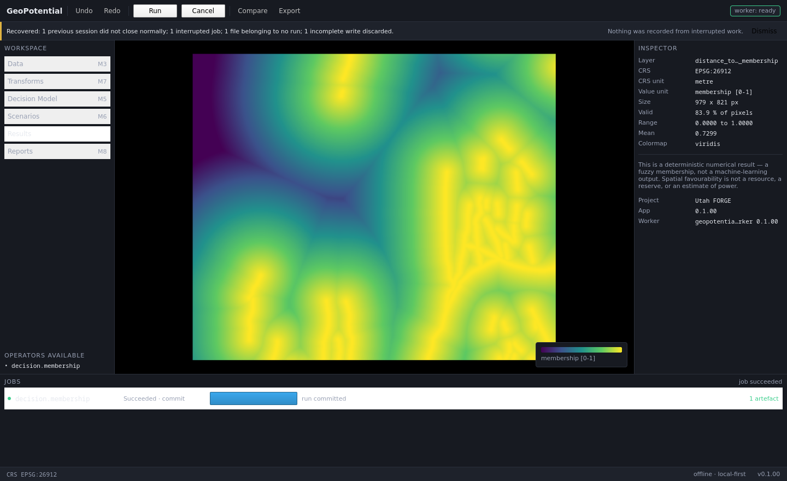

# V-M2 — Runtime, Project Store e recovery

Date: `2026-09-01`
Result: **PASS**
Milestone: `M2`
Plan: `../milestones/M2_RUNTIME_RECOVERY.md`
Environment: conda `mcda_geo`, Python 3.11.14, PySide6 6.10.1, SQLite 3.51.2,
Linux 6.5.0 x86_64

Reproduce from `geopotencial_msp/`:

```
./tools/run_gate.sh
./run.sh --self-test
```

---

## 1. Full regression gate

```
PASS               architecture           architecture: PASS — 53 modules, every layer contract held
PASS               architecture-negative  10/10 checks proved able to fail
PASS               schemas                IPC, project and operator schemas match the code
PASS               membership             Ran 19 tests in 0.040s OK
PASS               domain                 Ran 22 tests in 0.009s OK
PASS               protocol               Ran 18 tests in 0.001s OK
PASS               store                  Ran 17 tests in 0.698s OK
PASS               io-render              Ran 22 tests in 0.054s OK
PASS               commands               Ran 20 tests in 0.782s OK
PASS               recovery               Ran 25 tests in 1.374s OK
PASS               vertical-slice         35/35 checks passed

11 passed, 0 failed, 0 blocked, of 11
```

143 unit, contract and integration tests, plus 35 interface checks. Every M1
contract stayed green.

---

## 2. The M2 gate, requirement by requirement

`IMPLEMENTACAO_GEOPOTENTIAL_MSP.md` §20 M2 asks for five things.

| Requirement | Check | Evidence |
|---|---|---|
| fechar janela encerra filhos | 34 | `state=stopped, pid 201360 alive=False` |
| matar worker permite restart | 25, 26, 27 | killed → `crashed`; restart → `ready, starts=2`; next job `Succeeded` |
| cancelar não corrompe projeto | 17 | the cancelled job committed no run and no artefact |
| reabrir recupera estado | 28, 29, 30, 31 | `Interrupted` after reopen; unclean session seen; orphan listed; `.tmp` discarded |
| run concluída permanece imutável | 9, 32 | `UPDATE` refused; 2 runs intact after two kills |

The four kill tests §20 requires:

| Kill | Check | What was proved not to happen |
|---|---|---|
| forced kill of the worker | 24, 25 | no phantom result; the crash is detected rather than left as a stuck progress bar |
| kill during `Running` | 24, 28 | no `Succeeded` without a committed run; on reopen the job reads `Interrupted` |
| kill during `Committing` | 30, 31, 32 | no artefact registered without a run; no `.tmp` mistaken for output; committed runs intact |
| forced kill of the UI | 29, 30, 34 | no orphan child process; the dead session is visible to the next open |

---

## 3. `--self-test`, verbatim

```
geopotential_app 0.1.00, protocol 1.0.0
PASS  1  project created                                   SelfTest.gpot with 11 entries
PASS  2  worker handshake                                  state=ready, protocol=1.0.0, capabilities=['decision.membership']
PASS  3  worker started once                               start_count=1
PASS  4  worker out of process                             gui pid=201307, worker pid=201326
PASS  5  job reached a terminal state                      job=8c9377e4 state=Succeeded
PASS  6  progress real and monotonic                       13 updates over stages ['commit', 'membership', 'read', 'validate']
PASS  7  artefact registered against a run                 1 run(s), 1 artefact(s), distance_to_fault_membership.tif
PASS  8  hash recorded and correct                         sha256:c95c02fea36eac1caa4...
PASS  9  completed run is immutable                        UPDATE on a committed run was refused by the store
PASS  10 nodata declared as NaN                            nodata=nan, crs=EPSG:26912
PASS  11 membership within [0, 1]                          [0.000000, 1.000000] over 83.9% valid pixels
PASS  12 result displayed on the canvas                    979x821 on EPSG:26912
PASS  13 value under cursor is correct                     sampled 0.374651 at (331319.4, 4263750.2) vs stored 0.374651
PASS  14 nodata renders transparent                        alpha at the null is 0, at a valid pixel 255
PASS  15 a RAW criterion cannot be aggregated              CriterionStack.require_normalized refused it by name
PASS  16 no default CRS                                    a CRS-less raster was refused, naming the file
PASS  17 cancellation records no run                       the cancelled job committed no run and no artefact
PASS  18 no HTTP port open                                 listening TCP ports: none
PASS  19 no browser or web server imported                 web modules loaded: none
PASS  20 session and journal recorded                      session=e2dda279, open journal entries=0
PASS  21 log channels separate, refs resolve               channels on disk: application, scientific, worker; ref 47e73e06826a resolved
PASS  22 diagnostic carries no science                     5 entries, 0 scientific artefacts
PASS  23 science is not undoable                           undoText='Cannot undo cancel job 787b22a2'
PASS  24 kill during Running leaves no phantom result      the kill landed mid-run; no run was committed; pid 201326 alive=False
PASS  25 killed worker is detected as crashed              state=crashed
PASS  26 worker restarts after being killed                state=ready, starts=2
PASS  27 project intact: a job runs after restart          job after restart=Succeeded, runs 1 -> 2
PASS  28 kill during Running: reopen marks it Interrupted  job state after reopen=Interrupted
PASS  29 unclean session is detected on reopen             1 session(s) did not close normally
PASS  30 orphan file listed, never adopted                 1 orphan(s) reported, 0 registered
PASS  31 half-written .tmp discarded                       1 temporary file(s) removed
PASS  32 committed runs survive and stay immutable         2 run(s) intact after two kills
PASS  33 recovery is idempotent                            second pass: 0 interrupted, 0 temporaries
PASS  34 closing the window terminates the child           state=stopped, pid 201360 alive=False
PASS  35 clean shutdown closes the session                 1 unclean session (the one kill we forced), not more

35/35 checks passed
```

---

## 4. The mechanisms, and why each is shaped that way

**The journal is write-ahead.** A `job_journal` row goes down *before* the job
is submitted. Written after, a process killed in the gap would leave a running
job with no record that it existed, and its output directory would be
indistinguishable from an empty one. It closes only *after* the run and its
artefacts are recorded — closing it earlier would open the mirror-image window,
in which a crash left a committed run that recovery believed had never started.

**A session row is opened on open and closed only on a clean exit.** There is
nothing to ask the operating system after the fact about whether the last
session died, so the answer has to be written down in advance.

**Recovery resolves every ambiguity towards "this is not a result".**
An in-flight job becomes `Interrupted`, never `Succeeded`. A file with no
`artifact` row is **listed, never adopted** — a file the store did not hash and
register is not a result, however plausible it looks. A surviving `.tmp` is
deleted, because the writer renames only after validating and hashing, so a
surviving one is a write that died. The opposite error — adopting a partial
file as scientific output — is the one that cannot be detected later.

**The shutdown deadline is real.** Ask, wait, `terminate`, wait, `kill`. A
supervisor that only sends `shutdown` and returns leaves an orphan whenever the
worker is wedged, and a wedged worker is exactly the case §20 is about.

**A crashed worker takes its jobs with it, immediately.** Without that, a
killed worker leaves jobs at `Running` for the rest of the session and the
interface keeps a progress bar moving for work nobody is doing. Recovery would
fix it on the next open — but the user is still in this one.

**Undo reverts project state, never science.** A command that commits a run is
a *barrier*: it clears the stack and Undo goes disabled with the reason
visible (`Cannot undo …`). Letting undo walk past a committed run would either
delete a scientific record on a UI gesture or misrepresent what the project
contains, and the first thing a user tries is undoing exactly that.

**The diagnostic carries no scientific data.** Paths, versions, hashes, states,
durations and errors — never pixel values, never an artefact. Someone sends
this to support; it must not be their survey. Check 22 asserts the archive
contains no `.tif`, `.gpkg` or `.npy`, and the unit test asserts a known pixel
sentinel does not appear in any byte of it.

---

## 5. Evidence of the running application



A project whose previous session was killed with a job in flight, reopened.
The banner states what was found and what it means:

> Recovered: 1 previous session did not close normally; 1 interrupted job;
> 1 file belonging to no run; 1 incomplete write discarded.
> **Nothing was recorded from interrupted work.**

It is a persistent banner rather than a modal because the previous session's
damage is context for the work, not an interruption to dismiss before starting.

Capturing this required `--screenshot` to honour `--project`, which it did not:
it created a throwaway project unconditionally, so every screenshot was a
screenshot of a clean project and this state was unphotographable. Fixed.

---

## 6. One flaky check, and what replaced it

The first version of check 24 waited for the job to reach the `membership`
stage and then killed the worker. The operator finishes in about 60 ms, so the
run sometimes committed before the kill landed and the check failed — not
because anything was broken, but because it was asserting a race.

Slowing the operator for the test would have distorted the product, and
widening the assertion until it always passed would have removed the point. So
the check now kills immediately and asserts the **invariant** instead of the
timing: two outcomes are legitimate — the kill landed mid-run, or the run
completed first — and each has exactly one correct shape. What must never
happen is the mismatch: `Succeeded` without a committed run, or a run committed
for a job that reads `Interrupted`. The check reports which branch it took.

Verified stable over five consecutive runs, all reporting "the kill landed
mid-run; no run was committed".

---

## 7. What this does not prove

- **Nothing about a Project Hub.** There is still no create/open/recover/
  duplicate UI; the recovery *pass* and the *commands* exist and are gated, but
  the surfaces of §9.1 do not. Carried into M3.
- **Nothing about relink through the interface.** `relinkDataset` is
  implemented, gated and undoable, but nothing in QML calls it yet.
- **Nothing about power loss.** The kills are `SIGKILL` on a process. SQLite
  is in WAL mode and the writer `fsync`s before rename, but no test pulls power
  or simulates a filesystem that lies about `fsync`.
- **Nothing about concurrency.** One worker, one job at a time. A queue, a
  scheduler and backpressure are §18.1 and are not built.
- **Nothing about scale, the MCDA science, or packaging** — M4, M5 and M8, as
  before.
