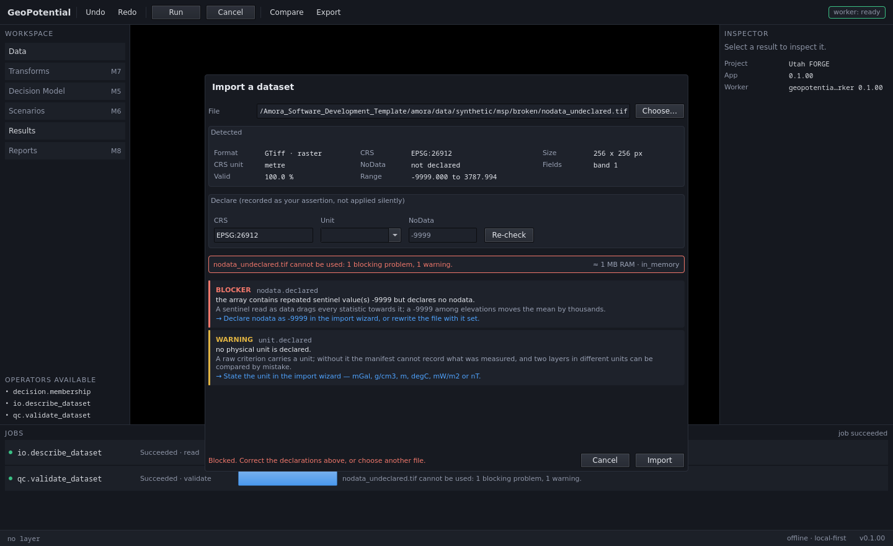
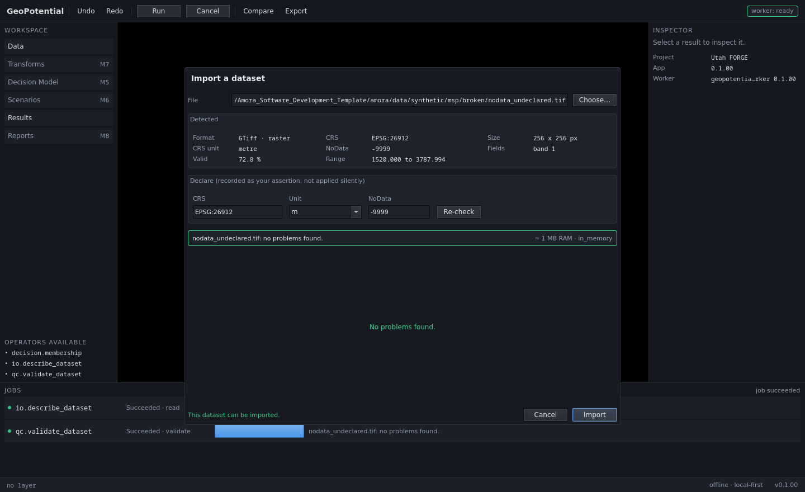

# V-M3 — Data Manager e QA/QC

Date: `2026-09-01`
Result: **PASS**
Milestone: `M3`
Plan: `../milestones/M3_DATA_MANAGER_QC.md`
Environment: conda `mcda_geo`, Python 3.11.14, PySide6 6.10.1, rasterio 1.4.4,
geopandas 1.1.2, SQLite 3.51.2, Linux 6.5.0 x86_64

Reproduce from `geopotencial_msp/`:

```
tools/make_broken_fixtures.py
./tools/run_gate.sh
./run.sh --self-test
```

---

## 1. Full regression gate

```
PASS               architecture           architecture: PASS — 60 modules, every layer contract held
PASS               architecture-negative  10/10 checks proved able to fail
PASS               schemas                IPC, project and operator schemas match the code
PASS               fixtures               broken fixtures: PRESENT — 14 defective datasets
PASS               membership             Ran 19 tests in 0.036s OK
PASS               domain                 Ran 22 tests in 0.009s OK
PASS               protocol               Ran 18 tests in 0.001s OK
PASS               store                  Ran 17 tests in 0.699s OK
PASS               io-render              Ran 22 tests in 0.052s OK
PASS               commands               Ran 20 tests in 0.867s OK
PASS               recovery               Ran 25 tests in 1.441s OK
PASS               describe               Ran 19 tests in 0.305s OK
PASS               qc                     Ran 15 tests in 0.535s OK
PASS               import                 Ran 15 tests in 4.367s OK
PASS               vertical-slice         43/43 checks passed

15 passed, 0 failed, 0 blocked, of 15
```

192 unit, contract and integration tests, plus 43 interface checks. Every M1
and M2 contract stayed green. The self-test was run three times consecutively;
43/43 each time.

---

## 2. The M3 gate, requirement by requirement

`IMPLEMENTACAO_GEOPOTENTIAL_MSP.md` §20 M3 asks for five things.

| Requirement | Check | Evidence |
|---|---|---|
| detectar erros | 21 | 12/14 fixtures raise their declared rule alone; the other 2 need cross-layer context and are covered by the integration suite |
| explicar erros | 22 | every finding names the dataset, the reason and the correction |
| permitir correção | 24 | declaring `nodata=-9999` turns a refusal into `no problems found` and unlocks import |
| impedir operação inválida | 23 | a BLOCKER refuses the import, and the refusal quotes the verdict |
| preservar audit trail | 25 | 16 `ValidationResult` rows recorded, 8 of them refusals |

Plus MSP-06's rule, which has no M3 gate line of its own but is the one the
milestone had to satisfy anyway:

| Requirement | Check | Evidence |
|---|---|---|
| nenhuma operação cara sem estimativa | 26 | 0.8 MB RAM, 0.2 MB disk, `in_memory`, 4 assumptions stated |
| um WARNING não bloqueia | 27 | `anisotropic.tif can be used, with notes: 1 warning.` |
| descrever não é importar | 20 | metadata read; 0 datasets and 0 runs created |

---

## 3. The fourteen defective datasets, and what the rules said

Derived from the real Utah FORGE raster by `tools/make_broken_fixtures.py`
(seeded, regenerable, written to `../data/synthetic/msp/broken/`). Each file
carries exactly one defect, and its `MANIFEST.json` declares the rule and the
severity the checks must return — **the manifest is the assertion, not a
description of whatever the code happens to do.**

| Fixture | Rule raised | Severity |
|---|---|---|
| `no_crs.tif` | `crs.present` | BLOCKER |
| `geographic.tif` | `crs.metric_required` | BLOCKER |
| `nodata_undeclared.tif` | `nodata.declared` | BLOCKER |
| `nodata_is_nan_undeclared.tif` | `nodata.declared` | BLOCKER |
| `all_null.tif` | `coverage.any_valid` | BLOCKER |
| `non_finite.tif` | `values.finite` | BLOCKER |
| `disjoint.tif` | `extent.overlap` | BLOCKER |
| `no_source_crs.csv` | `crs.present` | BLOCKER |
| `anisotropic.tif` | `grid.anisotropic` | WARNING |
| `coarse.tif` | `grid.resolution_mismatch` | WARNING |
| `mostly_empty.tif` | `coverage.fraction` | WARNING |
| `duplicated_points.csv` | `points.duplicates` | WARNING |
| `gapped_points.csv` | `points.gaps` | WARNING |
| `wrong_unit.csv` | `unit.plausible` | WARNING |

Four messages verbatim, because MSP-04 forbids reducing QA/QC to a generic
warning and the only way to show that is to quote them:

> **BLOCKER `nodata.declared`** — `nodata_undeclared.tif`: the array contains
> repeated sentinel value(s) -9999 but declares no nodata. A sentinel read as
> data drags every statistic towards it; a -9999 among elevations moves the
> mean by thousands. Declare nodata as -9999 in the import wizard, or rewrite
> the file with it set.

> **BLOCKER `extent.overlap`** — `disjoint.tif`: its extent does not intersect
> any other layer in the project. The analysis grid is the intersection of the
> inputs. A disjoint layer makes it empty, and an empty suitability map reads
> as 'nowhere is favourable' rather than as an error. Check the CRS and the
> coordinates — a layer in the wrong CRS usually lands somewhere plausible but
> far away.

> **WARNING `unit.plausible`** — `wrong_unit.csv` (g/cm3): values run from
> -217.4 to -201.6, outside the range normally seen for g/cm3 (1 to 6). A
> mislabelled unit passes every other check and produces a map that looks
> correct, because nothing downstream re-reads the physics. Confirm the unit is
> really g/cm3, or correct it in the import wizard.

> **WARNING `points.gaps`** — `gapped_points.csv`: there is an unsampled region
> about 1165 across, against a median sample spacing of 48. Interpolation fills
> the hole with a smooth surface, and the result carries no mark that the
> region was never measured. Mask the unsampled region, or keep the
> interpolation and record the gap so the map is read with it.

A test asserts, over every finding every rule produces, that it names the
dataset, carries a *what*, a *why* and a *fix*, and that the fix is not one of
a list of stock phrases (`check your data`, `invalid input`, …).

---

## 4. Evidence of the running application

### The wizard refusing



`nodata_undeclared.tif`, before any declaration. Import is **disabled**, the
footer says *"Blocked. Correct the declarations above, or choose another
file."*, and both findings are on screen in full — severity, rule, what, why
and the correction — rather than behind a dialog to dismiss.

Note what "Detected" reports: `Valid 100.0 %`, `Range -9999.000 to 3787.994`.
That is the defect made visible: the sentinel is being counted as data.

### The wizard after correction



The same file with `nodata = -9999` declared. The verdict becomes *"no problems
found"*, Import is enabled, and **the statistics change**: `Valid` drops to
`72.8 %` and `Range` becomes `1520.000 to 3787.994`. Nothing was rewritten —
the operator stated what the file failed to, and that statement is recorded in
`validation_result.declared_json` and as a `dataset.validated` provenance event.

---

## 5. Three defects found by building this, and how each was fixed

Recorded because each was invisible until something real exercised the path.

**A JS object from QML reaches Python as `QJSValue`, and dies at the IPC
boundary.** The wizard builds its declarations dynamically (`var d = {}; d["crs"]
= …`). That arrives at a `QVariant` slot not as a `dict` but as a `QJSValue`,
which `json.dumps` cannot encode — so it failed inside `protocol.encode`, the
worst possible place: the job had already been created and journalled, leaving
it stuck at `Validating` while the rest of the QML function was silently
abandoned. An object literal written *inline* in QML often is converted
automatically, which is what made this treacherous — the same code worked from
one call site and broke from another.

Fixed in two places: `utils/fromqml.py` converts recursively at the slot
boundary, and `WorkerSupervisor.send` now raises with the message kind, the job
id and the likely cause instead of letting a `TypeError` surface from inside
`json`.

**`Severity` inherited `str`, so `max()` ordered severities alphabetically.**
`"WARNING" > "BLOCKER"`, so a report containing a blocking defect described
itself as a warning. `Report.usable` was always correct — it counts blockers
directly — but the severity shown to the user was not. Now ordered by an
explicit `rank`, with the trap documented on the class.

**Qt Quick Controls paint from the palette, not from the theme tokens.** The
wizard's `GroupBox` drew its own light background, and near-white themed text
on it was invisible. Caught by cropping the screenshot rather than by looking
at it — a reminder that visual inspection of these renders has been unreliable
twice now. Fixed by giving the window a full palette derived from `Theme.qml`,
so every control inherits the theme and there is still one source of colour.

---

## 6. What this does not prove

- **Nothing about the Project Hub's surfaces.** Create, open, recover,
  duplicate and *recent projects* still have no UI; the commands exist and are
  gated. Relink likewise: implemented, undoable, tested, and not yet reachable
  from a screen. Carried to M4.
- **Nothing about the Data Inspector as a screen.** The description,
  statistics and histogram are computed, returned and gated, and the wizard
  shows the metadata — but §9.3's full panel, with the histogram drawn and the
  transformation history, is not built.
- **Nothing about the grid engine.** M3 delivers the *planner*. Reprojection,
  resampling, rasterization, distance and IDW are M5, and the planner's
  estimate has not yet been checked against a real operator's actual peak RSS.
- **Nothing about vertical datums.** `datum.vertical` reports the presence of a
  vertical CRS as INFO; no transformation between vertical datums exists.
- **Nothing about the MCDA science, scale, or packaging** — M5, M4 and M8, as
  before.
