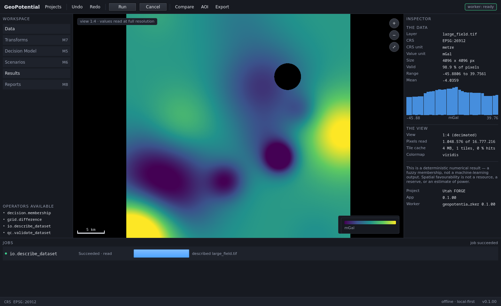
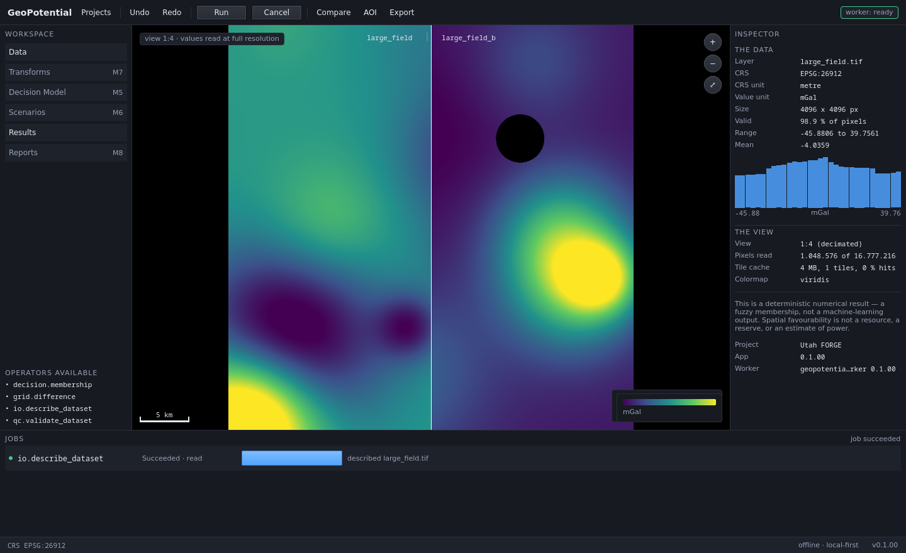

# V-M4 — GeoCanvas nativo

Date: `2026-09-01`
Result: **PASS**
Milestone: `M4`
Plan: `../milestones/M4_GEOCANVAS.md`
Environment: conda `mcda_geo`, Python 3.11.14, PySide6 6.10.1, rasterio 1.4.4,
SQLite 3.51.2, Linux 6.5.0 x86_64

Reproduce from `geopotencial_msp/`:

```
tools/make_canvas_fixtures.py
./tools/run_gate.sh
./run.sh --self-test
```

---

## 1. Full regression gate

```
PASS               architecture           architecture: PASS — 64 modules, every layer contract held
PASS               architecture-negative  11/11 checks proved able to fail
PASS               schemas                IPC, project and operator schemas match the code
PASS               fixtures               14 defective datasets; 2 rasters, 4096x4096
PASS               membership             Ran 19 tests in 0.036s OK
PASS               domain                 Ran 22 tests in 0.009s OK
PASS               protocol               Ran 18 tests in 0.001s OK
PASS               store                  Ran 17 tests in 0.724s OK
PASS               io-render              Ran 22 tests in 0.057s OK
PASS               commands               Ran 20 tests in 0.925s OK
PASS               recovery               Ran 25 tests in 1.585s OK
PASS               describe               Ran 19 tests in 0.309s OK
PASS               qc                     Ran 15 tests in 0.543s OK
PASS               import                 Ran 15 tests in 4.531s OK
PASS               canvas                 Ran 25 tests in 0.515s OK
PASS               aoi-diff               Ran 14 tests in 6.916s OK
PASS               vertical-slice         51/51 checks passed

17 passed, 0 failed, 0 blocked, of 17
```

231 unit, contract and integration tests, plus 51 interface checks. Every M1,
M2 and M3 contract stayed green. The self-test was run three times
consecutively; 51/51 each time.

---

## 2. The M4 gate, requirement by requirement

`IMPLEMENTACAO_GEOPOTENTIAL_MSP.md` §20 M4 asks for five things.

| Requirement | Check | Evidence |
|---|---|---|
| raster grande abre sem bloquear UI | 28 | 1 048 576 of 16 777 216 px (6.25 %) for a 1024 × 768 view |
| coordenada sob cursor correta | 30 | worst round-trip error 1.16e-10 px over 16 points in 4 views (fitted, panned, zoomed in, zoomed out and panned) |
| valor sob cursor correto | 31 | at 1:4 the tile says −18.0369, the source says −18.0481, the readout says **−18.0481** |
| AOI persistente | 32 | version 1 recovered with 4 vertices in EPSG:26912, area 9 000 000 m² after close and reopen |
| comparação operacional | 33 | split view aligns `large_field` and `large_field_b` on one viewport at 53.3 m/px; `grid.difference` computes A − B |

The six §10.4 test kinds:

| Kind | Where |
|---|---|
| snapshots | `--only canvas` — the same view renders identically; nulls stay transparent at every level |
| coordenadas numéricas | check 30; `--only canvas` round-trip under pan, zoom and resize |
| amostragem numérica | check 31; `--only canvas` sample equals the source pixel at four positions and on a null |
| picking | `--only canvas` — the level chosen for a scale, and the pixel chosen for a coordinate |
| LOD | check 29; `--only canvas` monotonicity, determinism, and never under-resolving |
| exportação visual | check 35 — 1024 × 1024 px written, the same pixels the canvas drew |

---

## 3. The measurement gate G1 rests on

The real Utah FORGE raster is 979 × 821 — small enough for a canvas to read
whole without noticing, so it cannot demonstrate anything about level of
detail. `tools/make_canvas_fixtures.py` derives a **4096 × 4096** field
(16 777 216 px), tiled at 256 × 256, with internal overviews at 2, 4, 8, 16
and 32.

| View | Scale | Level | Pixels read | Fraction |
|---|---|---|---|---|
| whole layer, 800 × 600 | 68.3 m/px | 1:4 | 1 048 576 | 6.25 % |
| whole layer, 1024 × 768 | 53.3 m/px | 1:4 | 1 048 576 | 6.25 % |
| zoomed 16×, 1024 × 768 | 3.3 m/px | 1:1 | 1 138 120 | 6.78 % |

The claim is not about milliseconds. It is that **the work is proportional to
the screen, not to the file**: zooming in by 16× reads roughly the same number
of pixels as the full view, because both fill the same screen.

Level selection is the coarsest level that still resolves the screen. One level
finer would double the read for detail the screen cannot show; one coarser
would lose detail the screen could.

---

## 4. The trap this milestone existed to avoid

A canvas that answers "what is the value here" from the tile it is displaying.
At level 1:4 that pixel is the average of 16 source pixels; at 1:32 it is the
average of 1024. Either way it is a number that appears **nowhere in the
dataset**, presented as a measurement.

So `raster/tiles.py` has two entry points that never meet:

- `read_window` — decimated, cached, for display, thrown away freely
- `sample` — one pixel, from the source, at full resolution, always

Check 31 forces the difference into the open: it finds a point where the
decimated value and the source value genuinely differ, then asserts the readout
matches the source and **does not** match the tile. An implementation that
answered from the tile would fail rather than coincide.

The interface says so too. A decimated view carries a badge reading
`view 1:4 · values read at full resolution`, and the inspector is split into
**THE DATA** (the worker's full-resolution statistics) and **THE VIEW** (level,
pixels read, cache) — because conflating them is the same error in a different
place.

---

## 5. The seam M1 opened, closed

M1 left one named exemption in the architecture gate: `render/map_item.py` was
allowed to import `rasterio`, so the vertical slice could end at a picture.
`docs/ARCHITECTURE.md` said it would close at M4, and it has.

Reading now lives in `raster/`, which may open files and may not know what a
colour is; `render/` is numpy-in-pixels-out again with no exception. The gate
enforces both directions — `render-no-io` and the new `raster-no-painting` —
and both are negative-tested (11/11, up from 10).

---

## 6. Evidence of the running application

### The large raster, decimated for display



16.8 megapixels in a 950 × 646 canvas. The badge states the view is 1:4 and
that values are read at full resolution; the scale bar reads 5 km; the legend
carries the unit. The inspector's two halves say what the data is (98.9 % valid,
−45.88 to 39.76 mGal, with the distribution drawn) and what the view is doing
(1:4, 1 048 576 of 16 777 216 pixels read, 4 MB of tile cache).

The nodata hole is drawn as the canvas ground, not as the low end of the ramp —
at every level, which `--only canvas` asserts separately.

### Split view



Both layers at the same extent and the same scale, each named above its half.
Comparing at two different scales would be worse than not comparing.

### An area of interest


Saved as version 1 with its CRS, its vertices and its area, and recorded as a
`aoi.saved` provenance event. Editing it creates version 2 and preserves
version 1 — a result computed inside an AOI is only interpretable if that AOI
can still be recovered.

---

## 7. Four defects found while building this

**A `Slot` returning a value is read once.** The inspector bound to
`canvas.layerSummary()`, so it showed the level of detail and the pixel count
from the first paint for the rest of the session. This is the first rule in
`docs/conventions/app.md`, written after the same mistake in another form, and it
was made again anyway. Now a `Property` with `NOTIFY`.

**A notify that fires before the work it describes.** `viewportChanged` was
emitted when the viewport was built — *before* any tile had been fetched — so
`pixels read` reported `0 of 16 777 216` forever. It now also fires after the
reads, when the count has actually changed.

**Statistics taken from the view rather than from the data.** The inspector's
range and mean came from the displayed tile. Fixed by splitting it into THE
DATA and THE VIEW, which is a better answer than making the tile's statistics
more accurate would have been.

**`Histogram.qml` used `Label` without importing `QtQuick.Controls`**, and a
QML bool binding refuses `undefined`. Both caught by running the shell, not by
reading it.

---

## 8. What this does not prove

- **Nothing about vectors on the canvas.** §10.2 asks for LOD simplification,
  spatial indexing, selection and picking of *vector* layers. The raster path is
  built and gated; the vector path is not. Carried to M5, where the criteria
  that need it arrive.
- **Nothing about hillshade or progressive preview.** §10.1 lists both. Hillshade
  needs a DEM and a stated illumination convention — M5, with the operator that
  produces it. Progressive preview (a coarse level shown while a finer one
  loads) needs the read to be asynchronous, and it is currently synchronous
  inside `paint`; on this fixture a read is 4–9 ms, so there is nothing yet to
  hide behind a preview. When there is, the measurement goes here first.
- **Nothing about `QQuickRhiItem` or shaders.** §10 permits the scene graph
  *when necessary*; necessity is a measurement, and none has been taken.
  `QQuickPaintedItem` is what the numbers currently justify.
- **Nothing about a country-scale mosaic.** 4096 × 4096 is large enough to
  prove the read is screen-proportional. It is not large enough to say anything
  about a multi-gigabyte VRT.
- **Nothing about the MCDA science or packaging** — M5 and M8, as before.
