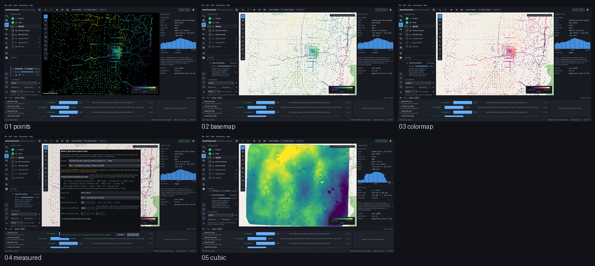

# Do ponto ao campo — Utah FORGE

Captured from the running application at 1440 x 880, offscreen. Regenerate with
`tools/capture_sequence.py demo`.

| # | Step | What it shows | Changed | Checks |
|---|---|---|---|---|
| 01 | `points` | As 3 735 estações gravimétricas do Utah FORGE, desenhadas. Um CSV entra, é conferido e é desenhado — antes de qualquer interpolação existir. | 0.0% | ok |
| 02 | `basemap` | O mapa de fundo por baixo do dado: desligado por padrão, só exibição, nunca insumo, e é o único momento em que esta aplicação toca a rede. | 42.9% | ok |
| 03 | `colormap` | A rampa trocada para magma. Repinta a vista e não reescreve valor nenhum — a faixa no Inspector é a mesma. | 5.9% | ok |
| 04 | `measured` | Qual interpolador serve, medido neste levantamento por validação cruzada. O produto não tem preferido: ele mede os três e reporta o erro na unidade do dado. | 41.3% | ok |
| 05 | `cubic` | O campo Clough-Tocher no canvas: cúbico por partes sobre a triangulação, liso na derivada primeira, e nulo fora do fecho convexo em vez de extrapolado. | 47.1% | ok |

`Changed` is the fraction of pixels differing from the previous frame. A step that changes nothing is a step that did nothing, and the runner fails on it.
