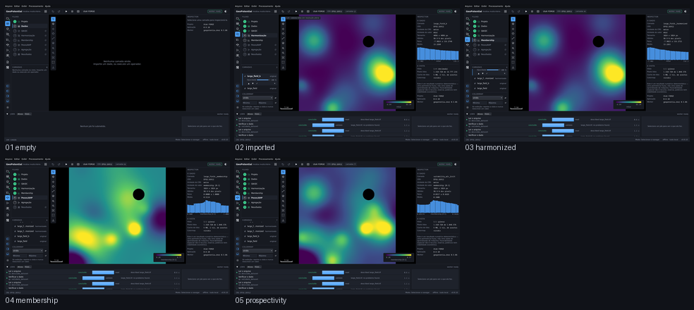

# E6 — o fluxo real, pela interface

Captured from the running application at 1440 x 880, offscreen. Regenerate with
`tools/capture_sequence.py flow`.

| # | Step | What it shows | Changed | Checks |
|---|---|---|---|---|
| 01 | `empty` | A aplicação recém-aberta, sem nenhum argumento de linha de comando: um projeto, e a etapa 2 esperando. | 0.0% | ok |
| 02 | `imported` | Dois rasters importados pelo botão Importar do próprio assistente, cada um com o seu veredito de QA/QC. | 40.1% | ok |
| 03 | `harmonized` | Uma grade de análise, com CRS, pixel e política de extensão escolhidos no diálogo — nenhum deles assumido. | 1.9% | ok |
| 04 | `membership` | Cada camada harmonizada vira um critério pelo botão Aplicar do editor, com a curva sobre o histograma. | 29.7% | ok |
| 05 | `prospectivity` | O mapa de prospectividade, ao fim de um fluxo que começou numa janela vazia. | 27.4% | ok |

`Changed` is the fraction of pixels differing from the previous frame. A step that changes nothing is a step that did nothing, and the runner fails on it.
