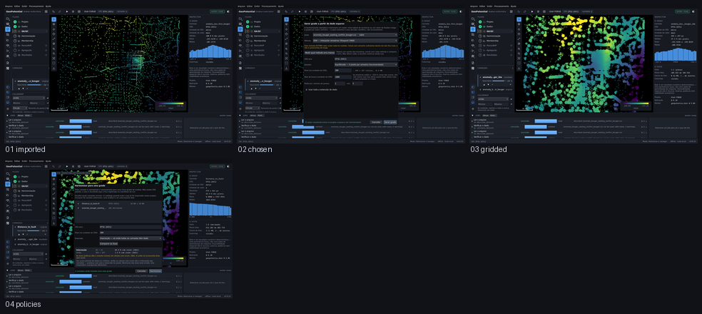

# M5.6 — dado esparso vira critério

Captured from the running application at 1440 x 880, offscreen. Regenerate with
`tools/capture_sequence.py gridding`.

| # | Step | What it shows | Changed | Checks |
|---|---|---|---|---|
| 01 | `imported` | O CSV no projeto: amostras desenhadas, e nenhuma delas harmonizável — harmonização lê raster. | 0.0% | ok |
| 02 | `chosen` | A tela de gerar grade, com o método escolhido e o aviso de que IDW estima valor onde nada foi medido. | 24.7% | ok |
| 03 | `gridded` | O campo interpolado no canvas, e o raster que saiu já entra na harmonização. | 34.4% | ok |
| 04 | `policies` | As duas políticas de extensão medidas antes de escolher: a união dá uma grade maior e a mesma área com score. Sonda read-only, nenhuma run registrada. | 24.7% | ok |

`Changed` is the fraction of pixels differing from the previous frame. A step that changes nothing is a step that did nothing, and the runner fails on it.
