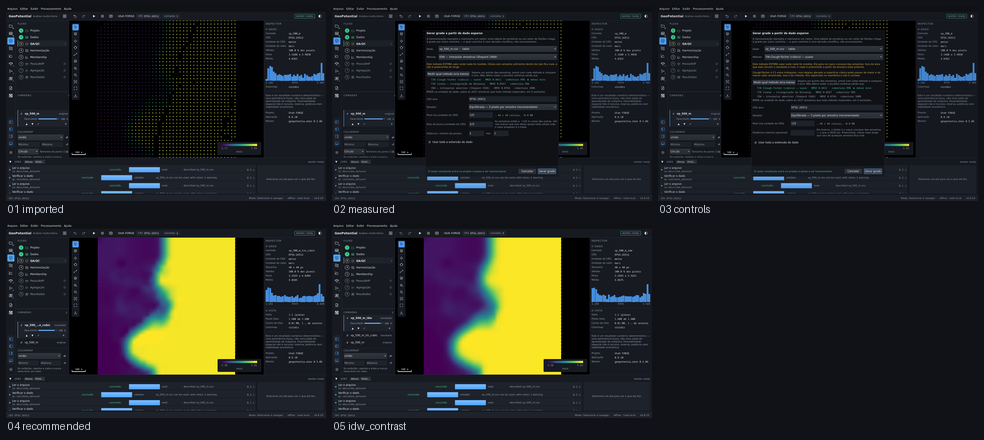

# M5.7 — o método é medido, não suposto

Captured from the running application at 1440 x 880, offscreen. Regenerate with
`tools/capture_sequence.py interpolation`.

| # | Step | What it shows | Changed | Checks |
|---|---|---|---|---|
| 01 | `imported` | O CSV numa malha regular de 125 m entra no projeto, e a tela passa a oferecer os três interpoladores do QGIS, não só o IDW. | 0.0% | ok |
| 02 | `measured` | O worker separa um quinto das amostras e mede o erro de cada método. Nada é gravado: é uma sondagem, e a escolha continua sendo de quem opera. | 24.6% | ok |
| 03 | `controls` | Escolher um método triangulado troca os controles: some o raio de busca, que ele não tem, e aparece a distância máxima, que ele aceita. Aparece também o aviso do cúbico. | 6.5% | ok |
| 04 | `recommended` | O método recomendado roda, e o manifesto registra o que limitou a superfície e quanto ela passou do intervalo das amostras. | 36.3% | ok |
| 05 | `idw_contrast` | O IDW na mesma grade, para contraste: a média ponderada alcança menos da faixa do dado do que o método recomendado. | 1.4% | ok |

`Changed` is the fraction of pixels differing from the previous frame. A step that changes nothing is a step that did nothing, and the runner fails on it.
