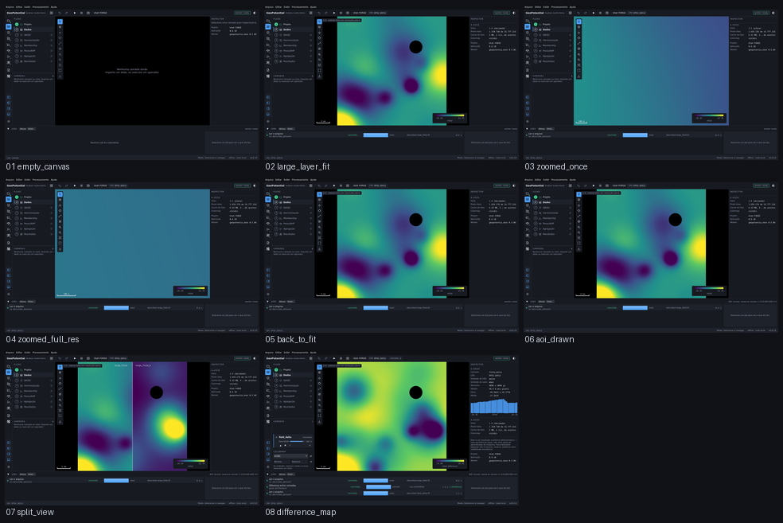

# M4 — GeoCanvas nativo

Captured from the running application at 1440 x 880, offscreen. Regenerate with
`tools/capture_sequence.py m4`.

| # | Step | What it shows | Changed | Checks |
|---|---|---|---|---|
| 01 | `empty_canvas` | The shell with no layer: every section that has not landed names its milestone. | 0.0% | ok |
| 02 | `large_layer_fit` | 16.8 Mpx fitted to the window. The badge states the view is decimated and that values are read at full resolution. | 33.1% | ok |
| 03 | `zoomed_once` | Zoomed in: a finer level is chosen and more detail appears, but the pixel count read stays screen-sized. | 35.9% | ok |
| 04 | `zoomed_full_res` | Zoomed to full resolution — the level reaches 1:1 and the scale bar shrinks with it. | 15.0% | ok |
| 05 | `back_to_fit` | Back to the whole layer, at the coarse level again — and the same colour as before the zoom, because the stretch belongs to the layer, not to the view. | 35.8% | ok |
| 06 | `aoi_drawn` | An area of interest, saved as version 1 with its CRS, its vertices and its area. | 0.1% | ok |
| 07 | `split_view` | Two layers on one viewport, at the same extent and the same scale, each named above its half. | 13.7% | ok |
| 08 | `difference_map` | A - B computed by the worker on the shared grid, drawn with a diverging ramp centred on zero. | 35.0% | ok |

`Changed` is the fraction of pixels differing from the previous frame. A step that changes nothing is a step that did nothing, and the runner fails on it.
