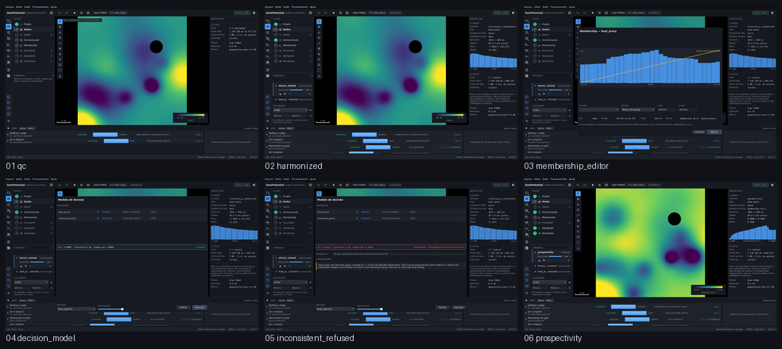

# M5 — Geothermal Decision Engine

Captured from the running application at 1440 x 880, offscreen. Regenerate with
`tools/capture_sequence.py m5`.

| # | Step | What it shows | Changed | Checks |
|---|---|---|---|---|
| 01 | `qc` | The layer, checked before anything is computed with it. | 0.0% | ok |
| 02 | `harmonized` | Two layers brought onto one target grid in EPSG:26912 at 40 m — the step every later one assumes. | 7.4% | ok |
| 03 | `membership_editor` | MSP-07's five things at once: histogram, curve, unit, physical sense and the range they act on. | 36.2% | ok |
| 04 | `decision_model` | Weights from a comparison matrix, with the consistency ratio on screen beside them. | 16.3% | ok |
| 05 | `inconsistent_refused` | CR above the threshold: Run is disabled, the reason is on the button, and the correlated pair is named. | 2.7% | ok |
| 06 | `prospectivity` | The suitability map: Fuzzy Gamma at 0.7 over the normalized stack, in [0,1], with a manifest that reproduces it. | 43.5% | ok |

`Changed` is the fraction of pixels differing from the previous frame. A step that changes nothing is a step that did nothing, and the runner fails on it.
