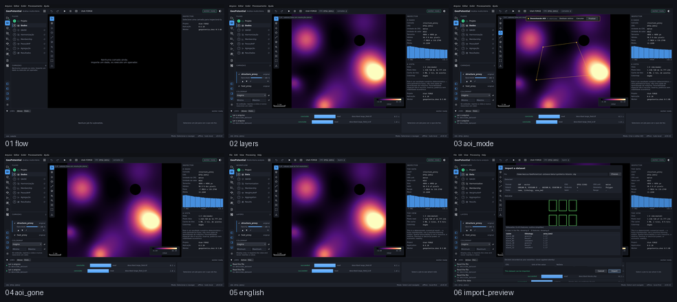

# M5.5 — Interface profissional

Captured from the running application at 1440 x 880, offscreen. Regenerate with
`tools/capture_sequence.py m55`.

| # | Step | What it shows | Changed | Checks |
|---|---|---|---|---|
| 01 | `flow` | Oito etapas, com o estado lido do projeto: a etapa 1 concluída, a 2 disponível, o resto bloqueado com o motivo. | 0.0% | ok |
| 02 | `layers` | Duas camadas na pilha, cada uma com o seu colormap. A ordem é ordem de desenho e não entra em nenhum manifesto. | 31.8% | ok |
| 03 | `aoi_mode` | O modo AOI: a faixa diz 'Desenhando AOI', os vértices têm marcadores, e desfazer, cancelar e finalizar estão à mão. | 2.1% | ok |
| 04 | `aoi_gone` | Fora do modo AOI não sobra nada na tela. Era este o defeito: linhas amarelas que ficavam para sempre. | 2.1% | ok |
| 05 | `english` | A mesma tela em inglês. Só o texto muda; nenhum painel se move. | 1.4% | ok |
| 06 | `import_preview` | O assistente de importação desenhando um shapefile: silhueta, fatos por tipo e histograma, antes de o arquivo entrar no projeto. | 35.4% | ok |

`Changed` is the fraction of pixels differing from the previous frame. A step that changes nothing is a step that did nothing, and the runner fails on it.
