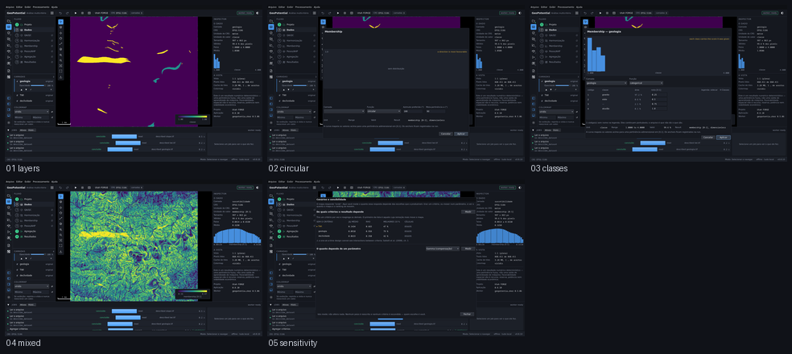

# Outro domínio — suscetibilidade a deslizamento

Captured from the running application at 1440 x 880, offscreen. Regenerate with
`tools/capture_sequence.py other_domain`.

| # | Step | What it shows | Changed | Checks |
|---|---|---|---|---|
| 01 | `layers` | Três camadas de suscetibilidade a deslizamento — declividade, TWI e geologia — em EPSG:5186. Nenhum gate anterior tinha saído do EPSG:26912 de Utah. | 0.0% | ok |
| 02 | `circular` | O editor de pertinência na curva circular, a única correta para azimute: 359° e 1° estão a dois graus um do outro, e toda curva linear os põe nas pontas opostas. | 36.0% | ok |
| 03 | `classes` | A tabela de classes sobre a geologia: um código por linha, com a área que ocupa e a nota que recebe. Aplicar espera a tabela inteira — pontuar zero uma classe é uma afirmação científica. | 5.9% | ok |
| 04 | `mixed` | Contínuo e categórico na mesma agregação, com a tabela de classes na procedência. Era o defeito: `categorical` estava no módulo e não ligada ao operador. | 43.0% | ok |
| 05 | `sensitivity` | E a sensibilidade do M6 sobre esta análise: os cenários são do produto, não do dataset geotérmico. | 40.9% | ok |

`Changed` is the fraction of pixels differing from the previous frame. A step that changes nothing is a step that did nothing, and the runner fails on it.
