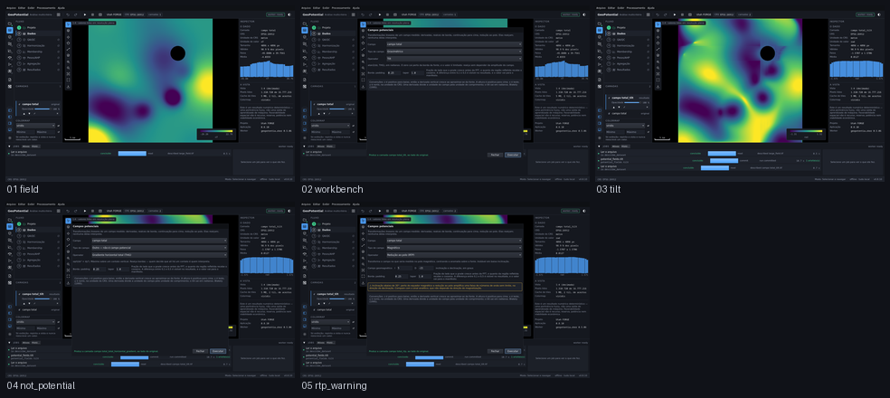

# M7 — bancada de campos potenciais

Captured from the running application at 1440 x 880, offscreen. Regenerate with
`tools/capture_sequence.py potential_fields`.

| # | Step | What it shows | Changed | Checks |
|---|---|---|---|---|
| 01 | `field` | O grid do campo na visualização, numa grade métrica — que é o que um filtro espectral aceita. | 0.0% | ok |
| 02 | `workbench` | A bancada: sete operadores, os parâmetros que o escolhido aceita, a borda como parâmetro, e as convenções à vista. | 36.2% | ok |
| 03 | `tilt` | O tilt rodado. Sai rotulado em radianos, o manifesto traz a convenção e a borda, e o original continua na pilha ao lado. | 40.5% | ok |
| 04 | `not_potential` | Declarar o dado como "outro" desabilita as cinco transformações que dependem de Laplace, com a razão no rótulo. O gradiente horizontal total continua: ele é matemática de grade. | 36.2% | ok |
| 05 | `rtp_warning` | RTP com inclinação de 5°: o alerta de instabilidade acende **antes** de executar, e diz o que fazer no lugar. | 5.9% | ok |

`Changed` is the fraction of pixels differing from the previous frame. A step that changes nothing is a step that did nothing, and the runner fails on it.
