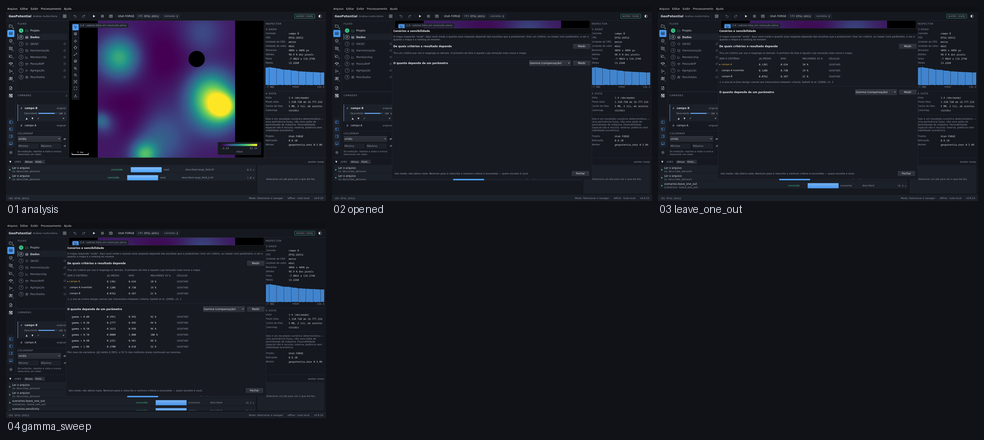

# M6 — cenários e sensibilidade

Captured from the running application at 1440 x 880, offscreen. Regenerate with
`tools/capture_sequence.py scenarios`.

| # | Step | What it shows | Changed | Checks |
|---|---|---|---|---|
| 01 | `analysis` | Uma análise de três critérios que discordam, para que tirar um tenha onde aparecer. | 0.0% | ok |
| 02 | `opened` | A tela de cenários pega a análise do Decision Model — os mesmos critérios, o mesmo operador — e abre sem inventar resultado nenhum. | 40.5% | ok |
| 03 | `leave_one_out` | O worker tira um critério por vez e reagrega. A primeira linha é aquela cuja remoção mais move o mapa, e cada número vem com quantas células foram comparadas. | 3.3% | ok |
| 04 | `gamma_sweep` | A varredura de gamma na mesma análise. Nada foi commitado, nenhum peso foi reescrito, e a primeira medição continua lá. | 1.8% | ok |

`Changed` is the fraction of pixels differing from the previous frame. A step that changes nothing is a step that did nothing, and the runner fails on it.
