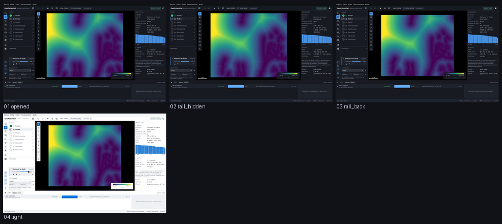

# M5.8 — a interface repaginada

Captured from the running application at 1440 x 880, offscreen. Regenerate with
`tools/capture_sequence.py shell`.

| # | Step | What it shows | Changed | Checks |
|---|---|---|---|---|
| 01 | `opened` | A janela como ela abre: a trilha de ícones à esquerda, o fluxo em uma linha por etapa, o mapa, o Inspector. Cada botão é um ícone e cada ícone tem a sua palavra na dica. | 0.0% | ok |
| 02 | `rail_hidden` | Exibir › Trilha de ícones: a trilha some, e a escolha fica guardada como a de qualquer outro painel. | 21.9% | ok |
| 03 | `rail_back` | E volta, com a mesma largura — um interruptor que só vai para um lado é um botão de apagar. | 21.5% | ok |
| 04 | `light` | O tema claro. Um ícone com cor própria fica bonito no escuro e some aqui; estes são recoloridos pelo tema, e nada mudou de lugar. | 60.0% | ok |

`Changed` is the fraction of pixels differing from the previous frame. A step that changes nothing is a step that did nothing, and the runner fails on it.
