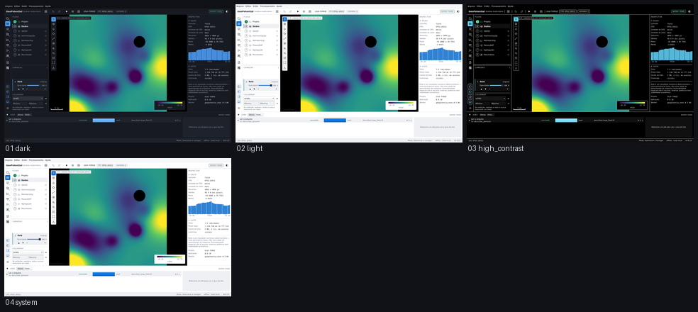

# E7 — os quatro temas

Captured from the running application at 1440 x 880, offscreen. Regenerate with
`tools/capture_sequence.py themes`.

| # | Step | What it shows | Changed | Checks |
|---|---|---|---|---|
| 01 | `dark` | O tema escuro, o padrão, com uma camada no canvas. | 0.0% | ok |
| 02 | `light` | O tema claro. Só as cores mudam: as bordas dos painéis caem exatamente nas mesmas colunas. | 60.4% | ok |
| 03 | `high_contrast` | Alto contraste — uma terceira paleta, com texto e bordas em 7:1 ou mais, medidos por `--only theme`. | 59.5% | ok |
| 04 | `system` | Automático, seguindo uma área de trabalho clara: idêntico ao tema claro, pixel a pixel. | 59.5% | ok |

`Changed` is the fraction of pixels differing from the previous frame. A step that changes nothing is a step that did nothing, and the runner fails on it.
